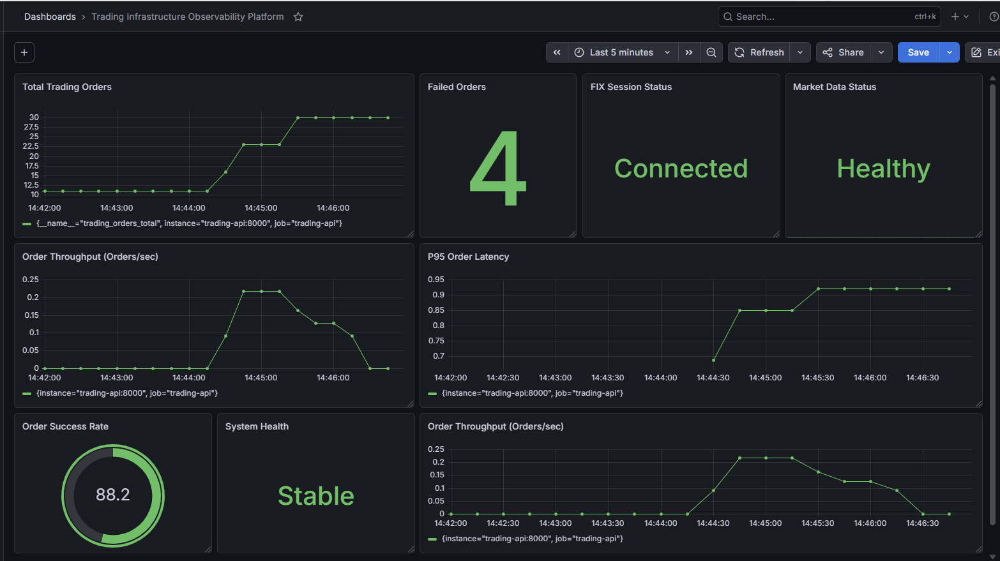
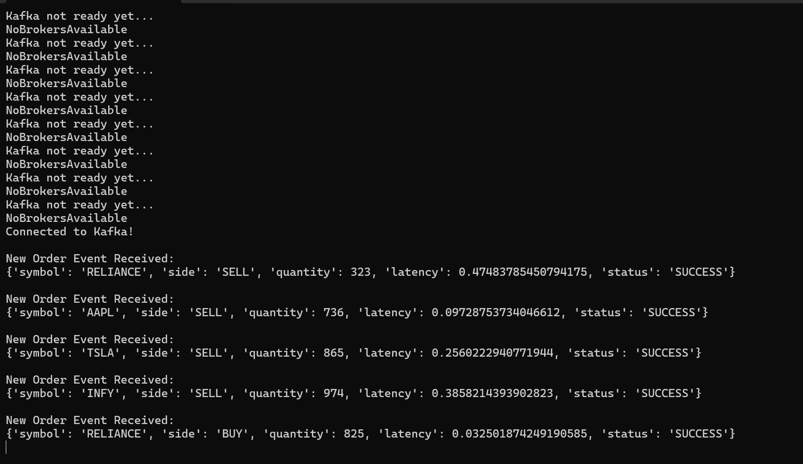
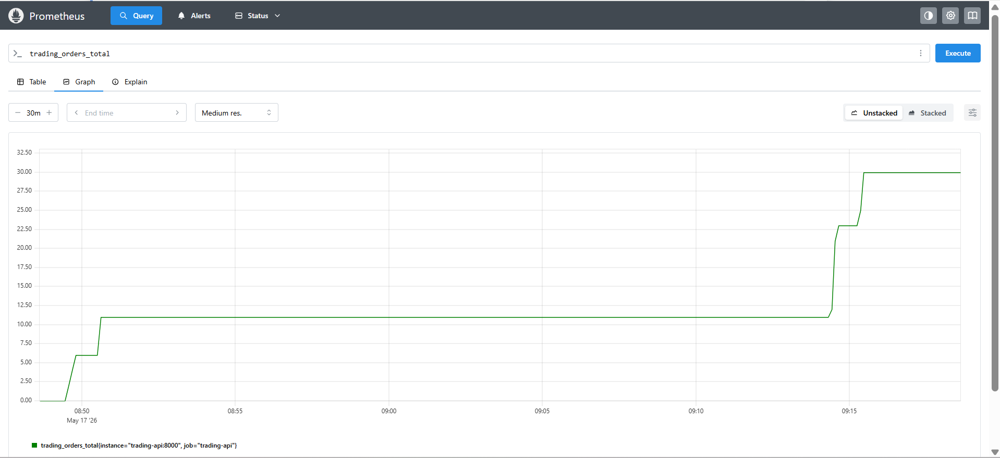
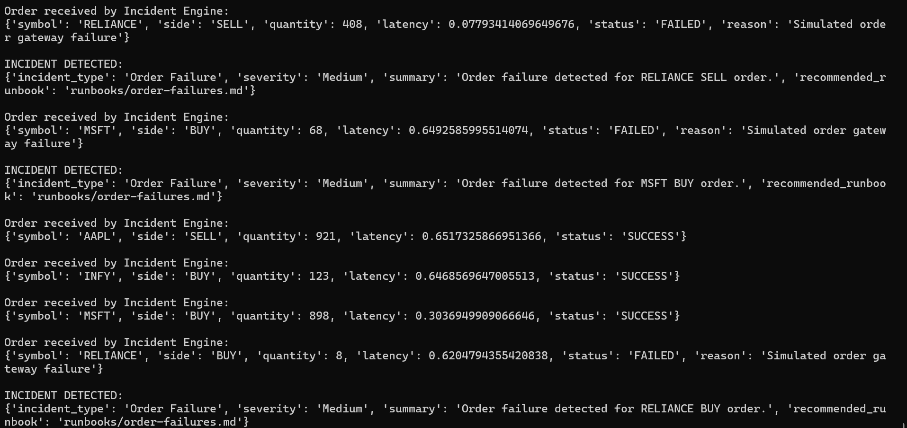

````md
# Trading Infrastructure Monitoring Platform

A production-style observability project that simulates trading infrastructure, order flow, FIX connectivity, Kafka event streaming, Prometheus metrics, and Grafana dashboards.

---

# Tech Stack

- Python
- FastAPI
- Docker
- Kafka
- Prometheus
- Grafana
- Kubernetes YAML
- OpenTelemetry Instrumentation

---

# Architecture

Trading API → Kafka Topic `orders` → Order Consumer
Trading API → Kafka Topic `orders` → Incident Intelligence Engine
Incident Intelligence Engine → Runbook Recommendation → Incident Summary
Trading API → Prometheus → Grafana Dashboard

# Incident Intelligence Engine

The Incident Intelligence Engine consumes Kafka order events and performs:

- Failed order detection
- Latency anomaly detection
- Incident classification
- Runbook recommendation
- AI-style incident summary generation

Example output:

```text
INCIDENT DETECTED:
Incident Type: Order Failure
Severity: Medium
Recommended Runbook: runbooks/order-failures.md
```

---

# Features

- Simulated trading order API
- Order success/failure simulation
- FIX session health simulation
- Market data health simulation
- Prometheus metrics endpoint
- Grafana monitoring dashboard
- Kafka producer and consumer
- Docker Compose setup
- Kubernetes deployment files
- Incident intelligence engine for failed orders and latency anomalies
- ML-based latency anomaly detection using Isolation Forest
- Runbook recommendation for production support scenarios
- AI-style incident summary generation

---

# Run Locally

```bash
docker compose up --build
````

Open:

```text
Trading API: http://127.0.0.1:8000
Prometheus: http://127.0.0.1:9090
Grafana: http://127.0.0.1:3000
```

---

# API Endpoints

```text
/health
/place-order
/metrics
/simulate-fix-disconnect
/simulate-fix-reconnect
/simulate-market-data-down
/simulate-market-data-up
```

---

# Kafka Flow

Every generated order is published to Kafka topic:

```text
orders
```

Consumer logs can be viewed using:

```bash
docker logs -f order-consumer
```

---

# Prometheus Metrics

```text
trading_orders_total
trading_failed_orders_total
trading_order_latency_seconds
fix_session_status
market_data_status
```

---

# Grafana Dashboard

Dashboard includes:

* Total trading orders
* Failed orders
* FIX session status
* Market data status
* P95 order latency

---

# Kubernetes

Kubernetes manifests are available in:

```text
k8s/
```

---

# Project Structure

```text
.
├── app
│   ├── Dockerfile
│   ├── main.py
│   └── requirements.txt
├── consumer
│   ├── Dockerfile
│   ├── consumer.py
│   └── requirements.txt
├── incident-engine
│   ├── Dockerfile
│   ├── incident_engine.py
│   └── requirements.txt
├── runbooks
│   ├── fix-disconnect.md
│   ├── high-latency.md
│   ├── market-data-down.md
│   └── order-failures.md
├── screenshots
│   ├── grafana-dashboard.png
│   ├── kafka-consumer.png
│   ├── prometheus-metrics.png
│   └── incident-engine.png
├── docs
│   └── kafka-flow.md
├── grafana
├── kafka
├── k8s
│   ├── grafana-deployment.yml
│   ├── prometheus-deployment.yml
│   ├── trading-api-deployment.yml
│   └── trading-api-service.yml
├── prometheus
│   └── prometheus.yml
├── docker-compose.yml
├── README.md
└── .gitignore
```

---

# Screenshots

## Grafana Dashboard



---

## Kafka Consumer Logs



---

## Prometheus Metrics



## Incident Intelligence Engine



---

# Author

Shaive Sharma

```
```
